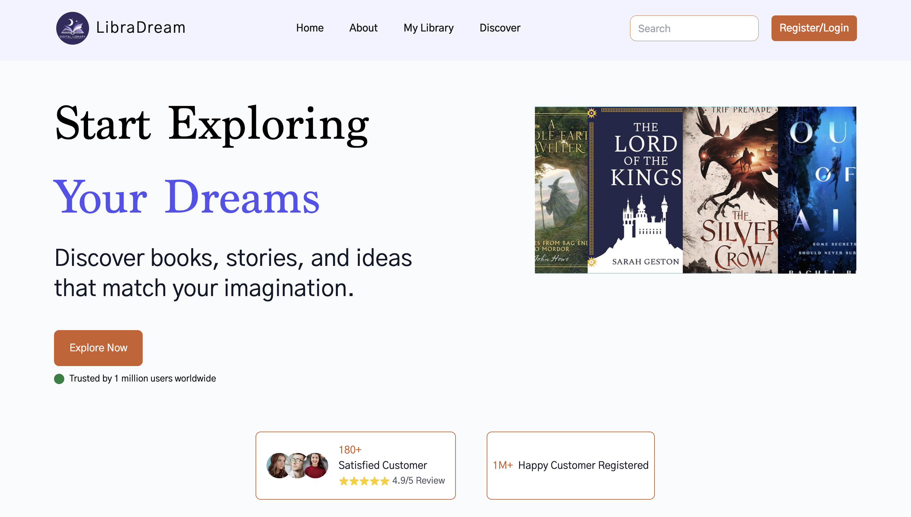
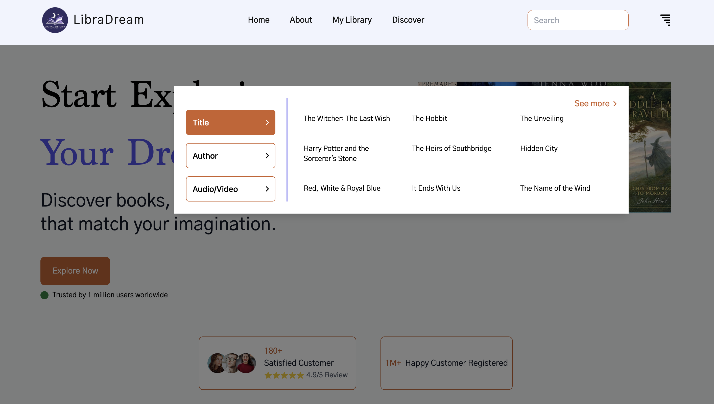
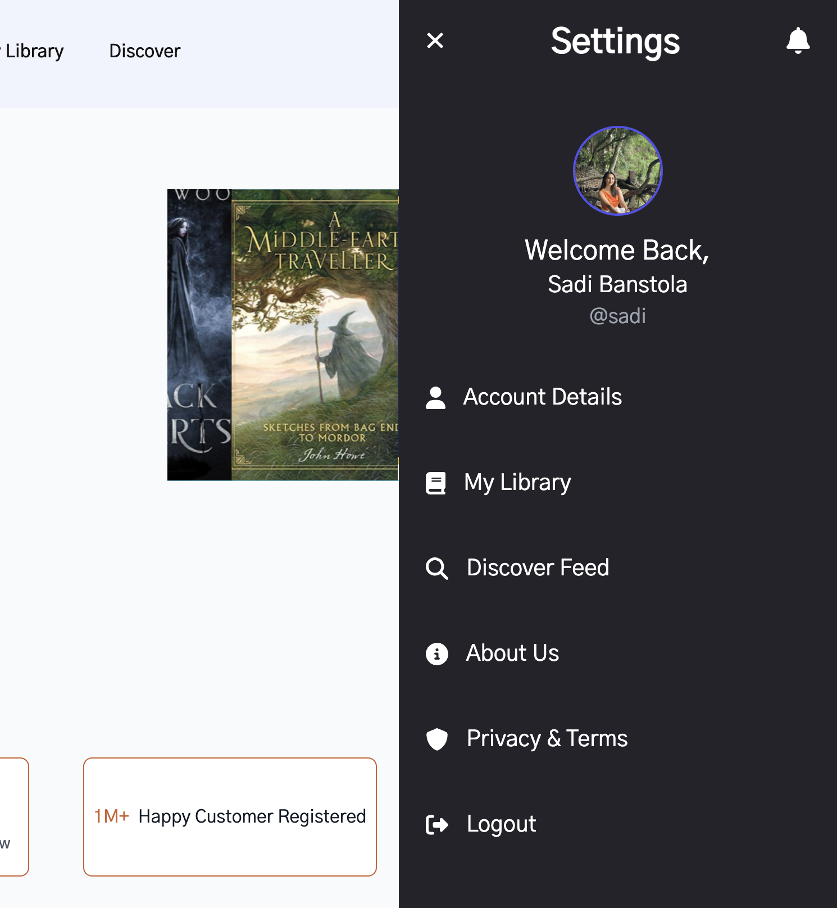
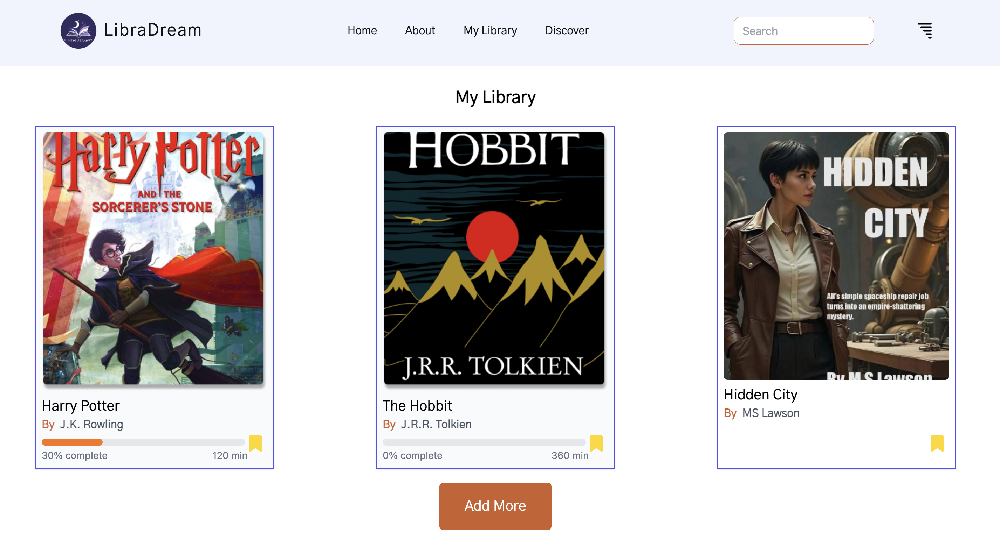
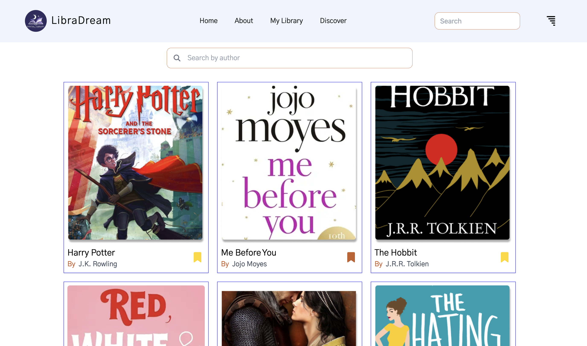
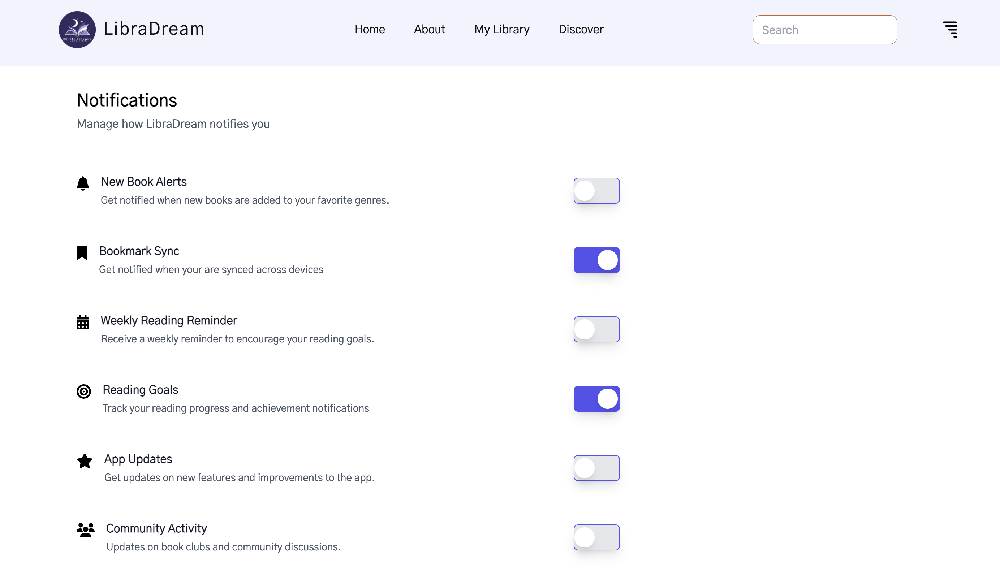

# Digital Library

**Digital Library** is a frontend-only React application developed during a Frontend React Internship at **Xdezo Technologies**. It offers users an interactive platform to browse a collection of books, view detailed information, and read selected books online. The application includes a dummy authentication system to enable protected features for logged-in users.

Currently, three books are available for reading:  
- *Harry Potter*  
- *The Hobbit*  
- *Red, White & Royal Blue*

## Live Demo

[Visit Digital Library on Netlify](https://digital-library-books.netlify.app)


##  Features

- ** Book Browsing** – View book cards with titles, authors, and cover images.
- ** Dummy Authentication** – Simulated login/signup toggles access to protected features.
- ** Protected Features (for authenticated users only):**
  - View full book details
  - Read selected books with multi-page navigation
  - Add/remove books to/from *My Library*
  - Browse books by genre
- ** Author Search** – Search books by author name (available to all users).
- ** Navigation** – Seamless back navigation to previous pages.

---

## 🛠️ Technologies Used

- **React** – Frontend library for building UI
- **React Router** – Client-side routing
- **Tailwind CSS** – Utility-first CSS framework
- **FontAwesome** – Icon library
- **Context API** – Global state management (authentication & favorites)
- **Vite** – Development server and build tool

---

## 📂 Project Structure

```text
digital-library/
├── src/
│   ├── Components/
│   │   ├── BookCard.jsx          # Reusable book card component
│   │   ├── BookReader.jsx        # Book reading view with page navigation
│   │   ├── Navbar.jsx            # Navigation bar, hidden on login/signup/reading pages
│   ├── Pages/
│   │   ├── Home/
│   │   ├── Login/
│   │   ├── SignUp/
│   │   ├── About/
│   │   ├── Footer/
│   │   ├── MyLibrary/
│   │   ├── AuthorSearch/
│   │   ├── GenreBooks/
│   ├── Private/
│   │   ├── BookDetails/          # Book details page (protected)
│   │   ├── ReadingContent/       # Book page content (e.g., RedWhitePages.jsx)
│   ├── context/
│   │   ├── AuthContext.jsx       # Manages dummy authentication state
│   │   ├── FavoritesContext.jsx  # Manages favorite books state
│   ├── App.jsx                   # Main app component with routing and NavigationContext
│   ├── Routes.jsx                # Defines app routes with protected routes
│   ├── ScrollToTop.jsx           # Ensures page scrolls to top on route change
├── public/                       # Static assets (e.g., book cover images)
├── package.json                  # Project dependencies and scripts
├── vite.config.js                # Vite configuration
└── README.md                     # Project documentation


## Screenshots

###  Homepage


### Discover 


###  Mood 


###  Profile


###  My Library


###  Book Details


###  Search By Author Name


###  Account


### Setting



